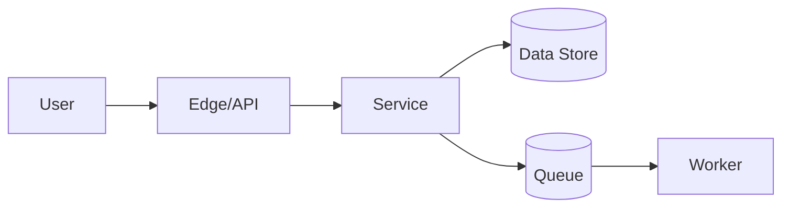

# Skill: System Design

## Đầu vào tối thiểu

Mục tiêu, actor, workload, dữ liệu, dependency, NFR, constraint và hệ thống hiện hữu. Nếu thiếu yếu tố làm đổi kiến trúc, hỏi; nếu không, nêu giả định định lượng.

## Quy trình

1. Vẽ context và trust boundary.
2. Ước lượng tải: request/event rate, concurrency, data volume, growth và peak factor; ghi công thức/giả định.
3. Xác định source of truth, invariant và consistency requirement.
4. Đề xuất 2–3 phương án; so sánh complexity, cost, latency, availability, operability, security và lock-in.
5. Chọn phương án đơn giản nhất đáp ứng NFR; nêu trigger để tiến hóa.
6. Mô tả component, interface, sync/async flow và ownership.
7. Phân tích failure mode: timeout, partial failure, duplicate, ordering, overload, dependency outage.
8. Thiết kế security, observability, deployment, migration, DR và rollback.
9. Ghi ADR cho quyết định có ảnh hưởng dài hạn.

## Mermaid gợi ý

Thay placeholder bằng tên domain; thêm trust boundary và failure path khi cần. Không coi sơ đồ mẫu là kiến trúc mặc định.

## Checklist

- [ ] NFR và capacity assumptions định lượng
- [ ] Boundary/ownership rõ
- [ ] Contract và data flow nhất quán
- [ ] Idempotency, concurrency, consistency được xử lý
- [ ] Timeout/retry/backpressure/degradation hợp lý
- [ ] SLI/SLO, log/metric/trace và alert
- [ ] Migration, compatibility, rollout, rollback
- [ ] Backup/restore, RPO/RTO và DR test
- [ ] Trade-off và rejected alternatives

## Anti-pattern

Microservices mặc định; single point of failure không được nêu; retry storm; cache không có invalidation; queue không có duplicate/replay strategy; “eventual consistency” không mô tả trải nghiệm người dùng.
