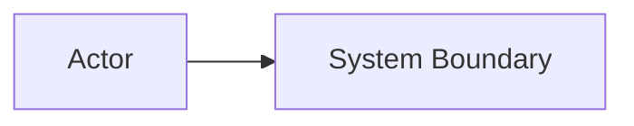
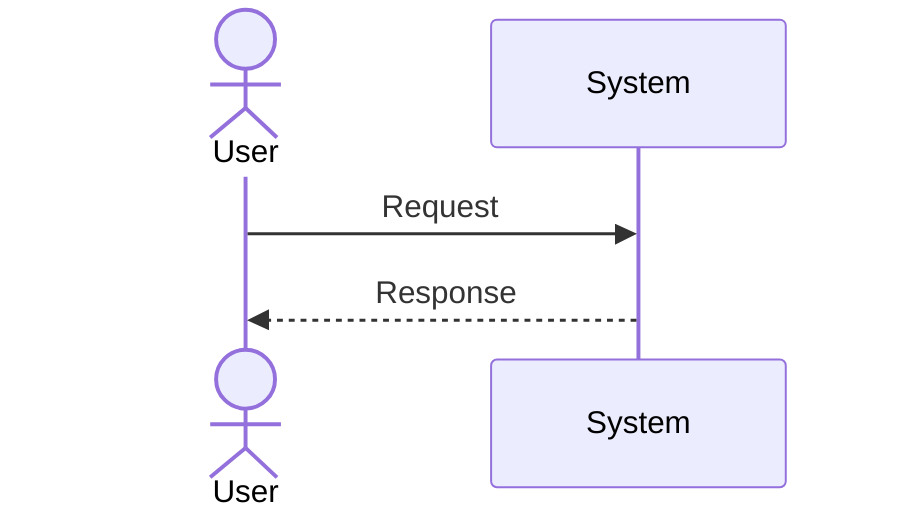
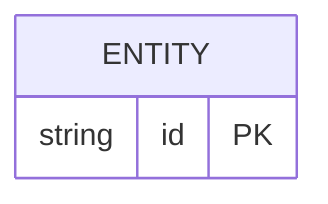

# Software Design Document: <Tên hệ thống/thay đổi>

- **Status:** Draft | In Review | Approved | Superseded
- **Owner:** <...>
- **Reviewers:** <...>
- **Last updated:** <YYYY-MM-DD>
- **Related ADR/issue:** <...>

## 1. Executive Summary

Vấn đề, outcome, recommendation và rủi ro chính.

## 2. Context

### Problem statement
<...>

### Goals / Non-goals
- Goal: ...
- Non-goal: ...

### Stakeholders và actors
<...>

### Constraints và dependencies
<...>

## 3. Requirements

### Functional requirements
| ID | Requirement | Priority | Acceptance criteria |
|---|---|---|---|

### NFR
| Dimension | Target/constraint | Cách đo |
|---|---|---|
| Latency | | |
| Throughput/concurrency | | |
| Availability/durability | | |
| Consistency | | |
| Security/privacy/compliance | | |
| RPO/RTO | | |
| Cost | | |

### Assumptions và open questions
| Item | Impact nếu sai | Owner/status |
|---|---|---|

## 4. Options và Trade-offs

| Option | Ưu điểm | Nhược điểm/rủi ro | Cost/operability | Khi nên chọn |
|---|---|---|---|---|

**Recommendation:** <...>  
**Revisit triggers:** <...>

## 5. Architecture

### Components và ownership
| Component | Responsibility | Owner | Dependencies |
|---|---|---|---|

### Main flow

### Failure paths và degradation
<timeout, partial failure, retry, duplicate, overload, dependency outage>

## 6. API / Event Contracts

<operation, schema, validation, authz, error, pagination, idempotency, versioning>

## 7. Data Model

<source of truth, invariant, index, transaction, consistency, retention, migration>

## 8. Security & Privacy

<trust boundary, threat, authn/authz, secret, encryption, abuse, audit, PII>

## 9. Capacity & Performance

<workload assumptions, calculation, bottleneck, benchmark/load-test plan>

## 10. Testing Strategy

| Risk/requirement | Test level | Scenario | Pass criteria |
|---|---|---|---|

## 11. Observability & Operations

<SLI/SLO, metric, log, trace, dashboard, alert, runbook, on-call>

## 12. Delivery, Migration & Rollback

- Phases: <...>
- Compatibility/feature flags: <...>
- Migration/backfill/validation: <...>
- Canary promote/abort criteria: <...>
- Rollback code/config/schema/data: <...>
- Post-rollback verification: <...>

## 13. DR và Recovery

<RPO/RTO, backup, restore drill, dependency>

## 14. Risks và Decision Log

| Risk/decision | Likelihood | Impact | Mitigation/ADR | Owner |
|---|---|---|---|---|

## 15. Open Questions / Next Steps

- [ ] <action — owner — due date>
