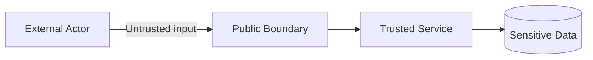

# Threat Model: <System/Feature>

- **Owner:** <...>
- **Review date:** <YYYY-MM-DD>
- **Scope/version:** <...>

## 1. Scope và Assumptions

- In scope: ...
- Out of scope: ...
- Assumptions cần xác minh: ...

## 2. Assets và Data Classification

| Asset/data | Sensitivity | Owner | Retention | Impact nếu lộ/sửa/mất |
|---|---|---|---|---|

## 3. Actors và Trust Boundaries

| Actor | Trust level | Capability | Authentication |
|---|---|---|---|

## 4. Entry Points và Data Flows

| ID | Entry/flow | Input/data | Authn/Authz | Dependency |
|---|---|---|---|---|

## 5. Threats

| ID | Threat/abuse case | Asset/flow | Likelihood | Impact | Existing controls | Residual risk |
|---|---|---|---|---|---|---|

Xem xét khi phù hợp: spoofing, tampering, repudiation, disclosure, DoS, privilege escalation; injection, SSRF, broken access control, replay, supply chain và insider risk.

## 6. Mitigations

| Threat ID | Prevent | Detect | Respond/Recover | Owner | Verification |
|---|---|---|---|---|---|

## 7. Security Requirements

- [ ] Deny by default và least privilege
- [ ] Server-side authorization theo resource/action/tenant
- [ ] Input validation/output encoding
- [ ] Secret/key lifecycle và rotation
- [ ] Encryption in transit/at rest theo risk
- [ ] Audit/redaction/retention
- [ ] Rate limit/abuse controls
- [ ] Dependency/provenance/vulnerability process
- [ ] Incident response và recovery

## 8. Accepted Risks

| Risk | Rationale | Approver | Expiry/review date |
|---|---|---|---|

## 9. Validation và Sign-off

<Test, review, scan hoặc exercise cần thực hiện. Không ghi “đã kiểm chứng” nếu chưa chạy.>
