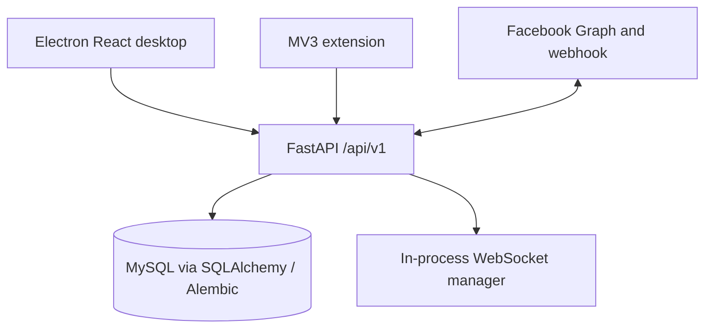

# Current architecture and implementation baseline

Audit date: 2026-09-24. Source: `origin/main` at `3bf76a7`. This describes checked-in code, not production configuration or a live database. No ADR exists in `docs/adr/` at this revision. Classification means **KEEP** the demonstrated boundary, **REFACTOR** it incrementally, **REDESIGN** the unsafe contract, or **REMOVE** an obsolete surface after compatibility review. Severity is based on plausible impact, not a demonstrated production exploit.

## Runtime map

`backend/app/main.py` builds the active app; `backend/main.py` exposes it. `backend/app/api/router.py` mounts `/api/v1`, while `backend/app/api/version.py` additionally mounts `/version`. The database engine/session live in `backend/app/db/session.py`; lifespan in `backend/app/startup/lifecycle.py` checks MySQL and constructs the in-memory WebSocket manager. `desktop/` is Electron with a Vite/React renderer and Axios services; `extension/` is a Manifest V3 service worker, content script and side panel. Only the backend persists core state.

## Findings ordered by risk

| ID / priority / classification | Evidence and effect | Smallest next step / verification |
|---|---|---|
| A01 High security · **REFACTOR** | `backend/app/api/facebook.py:967` exposes unauthenticated `POST /debug/webhook-selftest`; it reads arbitrary bodies and logs headers. `:886` returns a page token prefix to any active owning user. `backend/app/api/webhook.py:37-80,201` logs request headers and optionally raw payload in debug mode, including potential customer content. Exposure depends on deployment. | Remove or gate debug endpoints, redact payload/token prefix, cap body and header logging; negative auth tests and log assertions. |
| A02 High authorization · **REDESIGN** | `backend/app/models/auth.py` has roles, but `backend/app/dependencies/auth.py` only checks active user. Product, order, inventory and carrier mutation endpoints use `require_active_user`, not action-level permissions (`backend/app/api/{products,orders,inventory,carriers}.py`). Page ownership is enforced in services, but staff roles cannot express who may delete products or adjust stock. | Decide staff permission matrix, enforce backend action checks, test forbidden operations and page isolation. Breaking privilege behavior needs product approval. |
| A03 High security/data · **REFACTOR** | `backend/app/core/config.py:27` allows a fixed development JWT secret without environment-based production rejection. `backend/app/api/auth.py:33-49` refreshes bearer tokens without stored rotation/revocation; no durable session lifecycle. | Validate production secrets, define refresh revocation policy; add auth tests. |
| A04 High reliability · **REFACTOR** | `backend/app/services/facebook/conversations.py:198-251` calls Graph before committing the outgoing message. If the process/DB fails afterward, the remote message may exist without a local row; repeating a send may duplicate it. | Define send outcome/reconciliation and retry rules; mock failure after provider success, avoid blind retries. |
| A05 High reliability · **REFACTOR** | `backend/app/services/facebook/messenger.py:351-421` checks `mid` then inserts, with a unique DB constraint (`backend/app/models/messenger.py`). Concurrent webhook deliveries can both see no row; unhandled `IntegrityError` may return an error for an already persisted event. | Handle unique conflict by rereading winner, cover concurrent delivery on MySQL. Existing HMAC check (`messenger.py:30-47`) should be kept. |
| A06 Medium reliability · **KEEP / REFACTOR** | `backend/app/services/facebook/orders.py:534-567,885-1076` owns order transition, event and inventory in one commit; `inventory.py:320-421` locks balances in sorted product order with nonnegative constraints. Good foundation, but SQLite tests do not prove MySQL locking and deadlock behavior. | Preserve the transaction; add parallel MySQL tests and retry only safe deadlock cases. |
| A07 Medium contract · **REFACTOR** | `backend/app/api/router.py` hardcodes `/api/v1`, while `backend/app/core/config.py` exposes `API_V1_PREFIX` unused here. `backend/app/api/system.py` and `version.py` duplicate `/version` on different paths; `README.md` claims `/health` at root though code mounts `/api/v1/system/health`. | Freeze actual contract, remove misleading setting or wire with compatibility plan, add route/OpenAPI snapshot tests and update quick start. |
| A08 Medium integration · **KEEP** | `backend/app/carriers/manual.py` deliberately rejects waybill creation; `backend/app/services/facebook/waybills.py:202-293` reserves an operation but explicitly performs no network call. Shipment and external-waybill tables are foundations, not live J&T integration. | Keep manual workflow; implement provider only after credentials, verified API contract, outcome-unknown recovery and product decision. |
| A09 Medium realtime · **REFACTOR** | `backend/app/api/webhook.py:210-227` commits then broadcasts; `backend/app/websocket/manager.py` only stores local process connections. Multi-worker receivers can miss notices; broadcasts are not durable. Client should refetch DB. | Document single-worker limit or add a measured multi-worker fan-out when needed; reconnect/refetch tests. |
| A10 Medium client contract · **REFACTOR** | Backend `/api/v1/ws` requires an authenticated `metacrm`/`bearer.*` subprotocol and `page_id` (`backend/app/api/ws.py:42-90`); desktop constructs this protocol (`desktop/src/pages/MessengerInboxPage.tsx:220-225`), extension `websocketClient.ts` constructs an unauthenticated socket without page ID. | Make extension status report HTTP-only until it has legitimate auth/page context, or integrate existing auth; contract test. |
| A11 Medium maintainability · **REMOVE** | Root `main.py` is an entry alias for `backend/app/main.py`; separately, `backend/main.py`, `backend/README.md`, `backend/config.py`, `backend/database.py`, `backend/models/order.py` and `backend/services/*` describe/run an independent AI Sale BOT. The root alias imports `app.main`; legacy `backend/main.py` is not the active entry under the documented command. | Identify real consumers first, migrate entry documentation, then remove only unused legacy files. No runtime `create_all()` in active app; legacy `backend/main.py` calls it. |
| A12 Low hygiene · **REMOVE** | Tracked `m29_2_wip_*.diff` and `m29_2_wip_backup/*` duplicate in-tree shipment material. `.gitignore` excludes `.env`, caches, logs and uploads; no tracked generated build output found. | Archive/remove WIP snapshots after comparing with canonical migrations and verifying no dependencies. |

## Verification at audit time

- Python 3.12.14, below `pyproject.toml`'s `>=3.13`; backend dependencies were sufficient to start pytest, but full-suite result was unavailable after runner transport disconnected near 23% progress. **Do not treat suite as passed.** A separate `test_auth.py test_system.py` run returned 6 passed, 3 failed because `test_system.py` startup could not connect to MySQL at 127.0.0.1:3306; this environment has no local database. Targeted webhook signature/duplicate tests returned 3 passed (45 deselected).
- `python -m ruff check backend --no-cache`: failed with 365 findings (including E501/I001); existing baseline, no auto-fix applied.
- `desktop npm run build -- --emptyOutDir=false`: passed TypeScript, Vite and Electron compilation; Vite warned about a 1.41 MB bundle. The flag was forwarded to npm's child command; it does not change the reported compile result.
- `extension npm run build`: unavailable (`tsc: not found`), because extension dependencies were absent. No package installation or network build was attempted.
- No live MySQL migration upgrade, carrier integration, browser E2E, production configuration, load or security penetration test was run.

## Documentation drift and limits

`README.md` says infrastructure-only and root `/health`; `backend/README.md` gives SQLite/AI Sale BOT instructions while the active app requires a MySQL URL and Alembic. `docs/00_*` through `docs/25_*` describe a broader intended product, including POS, payments and J&T; they are specifications, not proof of delivery. No ADR files were present; the target documents below are recommendations and open decisions, not new ADRs. Volume, uptime, tenant model, staff roles, carrier API access and current production deployment are unknown.
