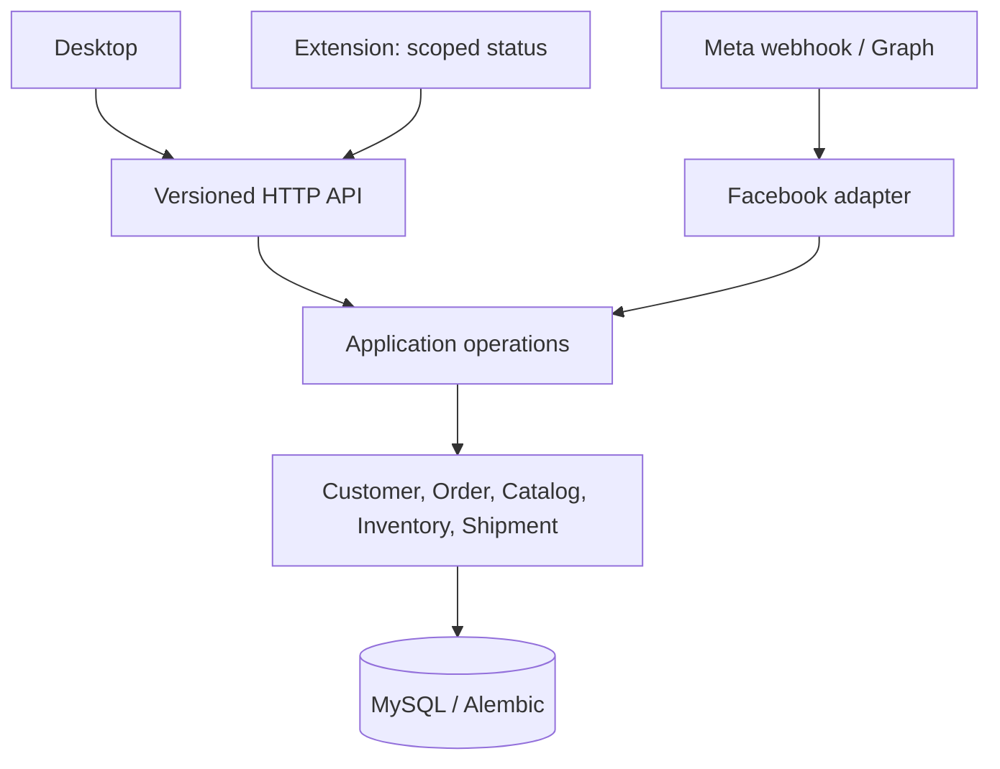

# Target architecture (incremental)

Status: audit recommendation, not an approved ADR. Evidence and priorities: [current baseline](current-architecture.md). Keep the FastAPI modular monolith, MySQL, Alembic, Electron renderer, and optional browser extension. No observed requirement justifies microservices, CQRS, event sourcing or another database. `OrderEvent` is a transaction-local audit ledger, not an event-sourced state store.

The HTTP layer authenticates, validates input and authorizes action + page before invoking application operations. Customer core owns identities/merge; Facebook adapter owns OAuth, Page, conversation, message and webhook normalization. Order owns status, totals, customer/product snapshots and order events; inventory owns balances/movements; shipment owns parcel status and immutable recipient snapshot; carrier adapter owns provider credentials and external operation outcome. A single session/transaction coordinates an operation crossing these modules; external network calls occur outside DB transactions and require explicit replay/reconciliation. See [domains](domain-boundaries.md) and [transactions](transaction-boundaries.md).

Use `/api/v1` as the existing wire contract. Keep the current response schemas and Idempotency-Key behavior until consumer tests approve changes. Identify stale `/version` and `API_V1_PREFIX` references without silently moving routes. Preserve per-page authorization; introduce a product-approved action permission matrix before granting employees different capabilities. Keep WebSocket payloads small, page-scoped invalidation signals; clients refetch authoritative state on reconnect. The current in-memory fan-out is adequate only for a single process; scale after evidence of multiple workers or dropped notifications.

Use existing Alembic revision chain and expand/migrate/contract for schema changes. Back up and restore-test before changing live data. Keep the manual carrier; do not claim real waybill issuance. An external carrier API is a separately gated integration: verified contract, credentials, idempotency and unknown-outcome reconciliation first. Avoid a generic queue/outbox until a concrete recovery requirement and measured failure mode warrant it.

Trade-offs: a single process keeps operations simple but limits realtime fan-out; explicit MySQL transactions protect stock at the cost of lock contention; HTTP refetch costs requests but avoids treating transient WebSocket signals as state. Revisit when concurrent MySQL tests, measured load, multi-worker deployment, or carrier contract reveal unmet needs. No capacity/SLO/RPO/RTO numbers are asserted without measurements and product input.

Open decisions for product owner: staff roles/action matrix; whether AI reply automation, POS/payments and J&T API are actually in product scope; data retention/export/deletion policy; operational deployment size and recovery targets. These are gates for affected milestones, not reasons to postpone safe baseline work.
